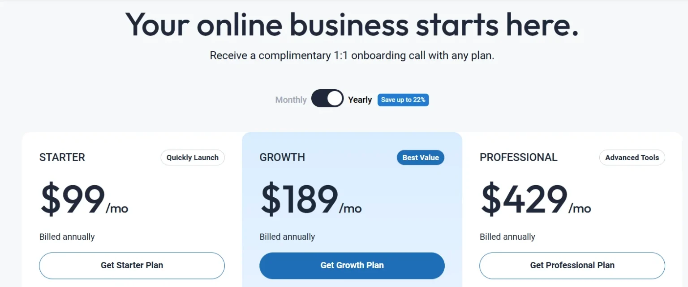
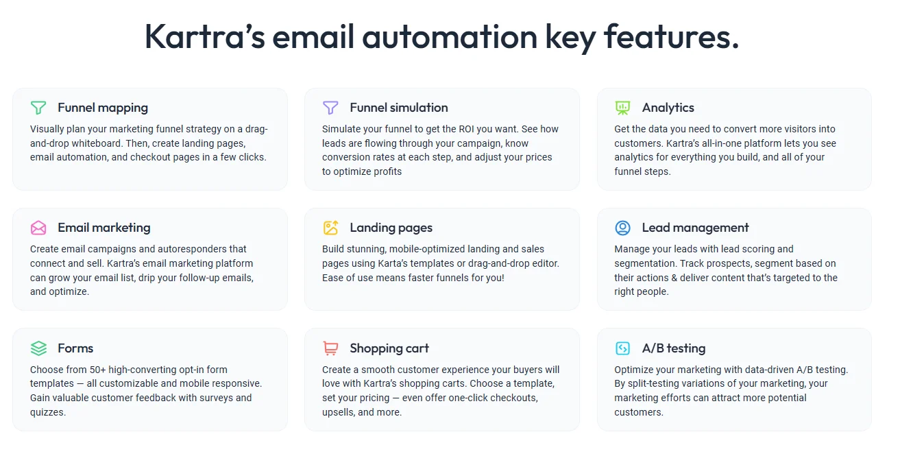

# Kartra Review 2025 : All-in-One Platform Really Worth Trying?

When I first discovered Kartra, I was overwhelmed by the chaos of using too many tools—Mailchimp for emails, ClickFunnels for landing pages, Teachable for courses, and a stack of other platforms barely holding it all together.

If that sounds like your setup, you’re not alone.

Running an online business shouldn’t feel like managing a tech circus.

That’s why I decided to give Kartra a real shot—and after months of using it across my own business and client projects, I’ve learned exactly where it shines and where it doesn’t.

In this Kartra review, I’ll walk you through its key features, pricing, pros and cons, and who it’s actually built for.

Let’s get into it.

## What Is Kartra? 
(https://www.bloggersideas.com/Recommended/kartra/)

Kartra is an all-in-one platform designed to help small businesses and entrepreneurs sell their products or services online.

It allows you to build websites, landing pages, sales funnels, email campaigns, and even online courses—all without needing to know how to code.

Launched by Genesis Digital, the same company behind WebinarJam and EverWebinar, Kartra combines multiple essential marketing tools into one seamless experience.

Instead of switching between different tools, Kartra puts everything you need in one place, making it easier to manage your business, reach customers, and automate things like emails and payments.

Think of it as a complete digital toolkit for running your online business smoothly and efficiently.

(https://www.bloggersideas.com/Recommended/kartra/)

## Who Is Kartra For?

Kartra is a great fit for entrepreneurs, small business owners, and digital marketers who want to manage everything in one place.

It’s especially useful if you’re handling things like building websites, sending emails, selling products, and supporting customers on your own.

If you're feeling overwhelmed by using too many separate tools, Kartra offers a simpler, more organized way to run your online business.

## What Does Kartra Provide?

### 1. Website and Landing Page Builder

One of the best things about Kartra is how easy it makes building pages.

Using a drag-and-drop editor, you can quickly create professional-looking websites, landing pages, sales pages, or opt-in forms—without needing any coding skills.

It comes with a wide range of templates that you can customize to fit your brand.

Everything is mobile-friendly, so your site looks great on any device right from the start.

While it may not be as flashy as tools like Elementor, it’s powerful, clean, and built to convert.

### 2. Sales Funnels and Campaign Builder

Creating sales funnels in Kartra is super simple.

Whether you're launching a product or running a lead generation campaign, Kartra gives you ready-made funnel templates to work with.

You can map out each step of your customer's journey—from landing page to checkout—and track how people move through your funnel.

You can also A/B test different versions to see what works best and improve your conversion rates.

### 3. Email Marketing & Automation

Email is still one of the most effective ways to grow an online business, and Kartra takes it seriously.

It has a built-in email system that lets you send personalized emails based on your audience’s behavior.

You can automate follow-ups, send targeted broadcasts, and tag users depending on what actions they take (like clicking a link, watching a video, or buying something).

Everything works together smoothly because it’s all under one system no need for outside email software.

### 4. Membership Sites and Online Courses

If you sell online courses, memberships, or subscription-based content, Kartra makes it easy to manage.You can create multiple membership levels, drip out content over time, and give users access based on their subscription.

Everything is hosted inside Kartra, so you don’t need an extra platform like Teachable or Kajabi.You also get helpful insights like where members drop off, so you can improve the learning experience.

### 5. Checkout System and Payments

Selling products or services?

Kartra Checkouts handles everything from payments to upsells. You can sell digital or physical products, offer one-time purchases or subscriptions, and even create product bundles.

It supports Stripe and PayPal, and includes affiliate tracking built in no extra tools required. You can also test different checkout designs to see what converts best.

### 6. Video Hosting with Built-In Actions

One feature that sets Kartra apart is its built-in video hosting.

Instead of paying for third-party platforms like Vimeo or Wistia, you can upload and use your videos directly inside Kartra.

Even better?

You can add CTAs (calls to action), email opt-ins, or automation triggers based on how much of the video someone watches.

This is super helpful for webinars, VSLs (video sales letters), and training content—especially when you want to follow up with viewers automatically.

## 7. Helpdesk and Customer Support Tools

Kartra isn’t just about selling—it also helps you support your customers.

It has a built-in helpdesk that lets you manage support tickets, live chats, and even a knowledge base.

Instead of using tools like Zendesk or Freshdesk, everything is available right inside Kartra.

This means you can handle both marketing and support without switching platforms, making life easier for you and your customers.

(https://www.bloggersideas.com/Recommended/kartra/)

## Kartra Pricing Plans Overview

$1 Trial:
Try Kartra for 30 days for just $1.
Build pages, create courses, collect leads, and send up to 1,000 emails.

Starter Plan – $99/month for first 3 months
Get your first 3 months for $99/month, then $119/month after.
Billed monthly.
Includes unlimited emails, 2,500 contacts, 1 domain, and up to 5 team members.
Great for solopreneurs and small teams.

Growth Plan – $229/month
Includes 12,500 contacts, 3 domains, and up to 10 team members.
Perfect for scaling businesses.

Professional Plan – $549/month
Includes 25,000 contacts, 5 domains, and up to 20 team members.
Best for advanced marketing teams and growing agencies.

(https://www.bloggersideas.com/Recommended/kartra/)

## Kartra Pros and Cons

### Pros

✅ Truly all-in-one platform
✅ Advanced automation and tagging
✅ Integrated video, email, and landing pages
✅ Built-in affiliate management
✅ Clean UI with consistent updates
✅ Fast customer support

### Cons
❌ Learning curve for beginners
❌ Slightly dated page editor UI
❌ No native blogging feature (use WordPress or Ghost separately)
❌ Limited design flexibility compared to standalone builders

## Kartra vs the Competition
Here’s how Kartra stacks up:

1. Kartra vs ClickFunnels: Kartra wins on automation, built-in features, and pricing. ClickFunnels 2.0 is more design-forward but lacks depth in native features.

2. Kartra vs Kajabi: Kajabi is better for branding and community-building. Kartra is better for funnel strategy and automation.

3. Kartra vs Systeme.io: Systeme is cheaper but not as robust or scalable. Ideal for starters, not serious businesses.

## FAQs About Kartra
1. Is Kartra good for beginners?
It has a learning curve, but their templates and tutorials help. If you're committed to scaling, it’s worth the upfront effort.

2. Does Kartra replace my email tool?
Yes. It has a robust built-in email marketing system with automations.

3. Can I blog on Kartra?
Not natively. You’ll want to use WordPress or Ghost for blogging and link it.

4. Is there a free trial for Kartra?
Yes, Kartra offers a 14-day trial (sometimes for $1). Take advantage of it to test all the features.

## Final Verdict: Is Kartra Worth It?
If you’re tired of patchworking tools and want to simplify your business backend, Kartra is absolutely worth it.

It’s not just an app it’s a business operating system. While it's a little tricky to use , the trade-off is immense time saved and serious growth potential.

I’ve used nearly every funnel and marketing platform out there, and Kartra is one of the few I recommend confidently.

For solopreneurs and small teams ready to scale with automation and efficiency, it’s a no-brainer.

Learn More About [Kartra](https://www.affiliatebooster.com/kartra-review/) at Affiliate Booster. 

