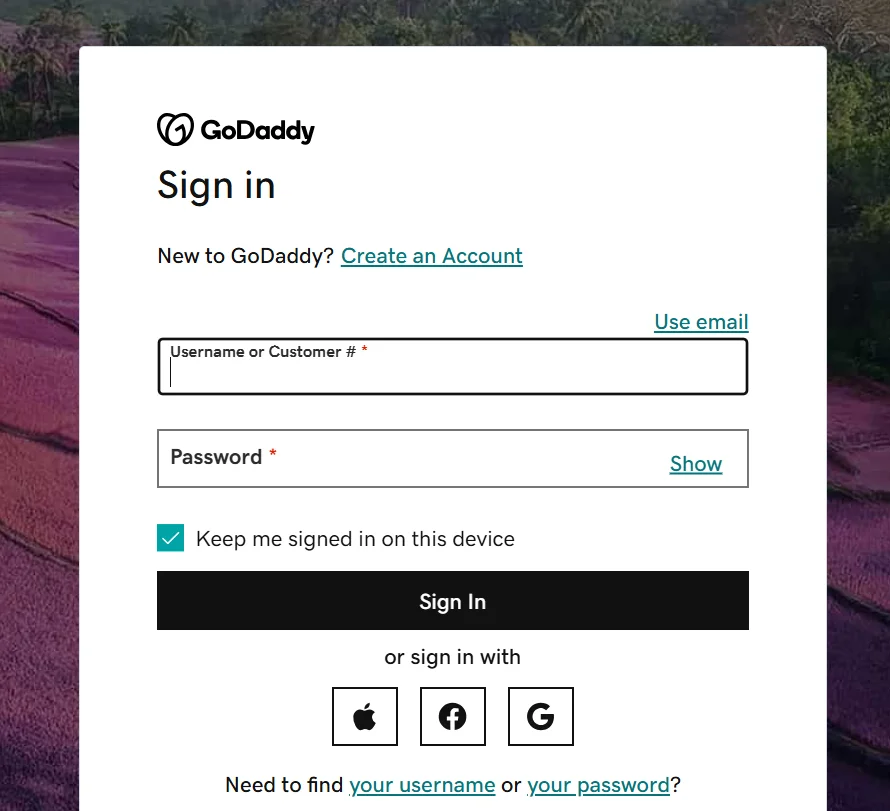

# Godaddy Renewal Coupon Code & Promo Codes 2025

Looking for a GoDaddy renewal discount? You can save up to 60% today! I've been using GoDaddy for years and always search for deals before renewing.

Here’s a quick guide to help you get the discount and save on your site renewal.

## 💸 Latest GoDaddy Renewal Coupon Codes & Deals

### [RENEW10](https://bytegain.com/Recommended/godaddy)

Get 10% off on domain renewals, ideal for individual domains.

### [HOSTRENEW15](https://bytegain.com/Recommended/godaddy)

Enjoy 15% off on web hosting renewals, suitable for both shared and managed hosting plans.

### [SSLRENEW20](https://bytegain.com/Recommended/godaddy)

Save 20% on SSL certificate renewals, helping secure your site at a lower cost.

### [SERVICES25](https://bytegain.com/Recommended/godaddy)

Receive 25% off when renewing multiple services, great for users with domains, hosting, and security products.

## How to Use GoDaddy Renewal Coupon Codes?

Step 1: Log in to your GoDaddy account.

Step 2: Go to "Renewals & Billing" in your dashboard.

Step 3: Choose the services (domains, hosting, etc.) you want to renew.

Step 4: Click "Renew Now" to go to checkout.

Step 5: Enter your promo code in the coupon code box.

Step 6: Check that the discount is applied to your total.

Step 7: Finish payment to complete the renewal.

## Tips for Saving on GoDaddy Renewals

✅ Use Multi-Year Renewals – Renew for several years at once to avoid yearly price hikes.

✅ Bundle Services – If renewing multiple services, look for discounts or use a coupon code to save more.

✅ Set Auto-Renew with Reminders – Auto-renew keeps your service active, but setting reminders lets you find coupons before renewal.

✅ Watch for Seasonal Deals – GoDaddy offers discounts during holidays or year-end, so keep an eye out for special offers.

✅ Check Loyalty Programs – GoDaddy may offer discounts to long-time customers or for bulk renewals.

# Why Choose GoDaddy Renewal?

✅ **Reliable Service** – GoDaddy is a trusted name with years of experience in domain and hosting services.

✅ **Easy Management** – Their user-friendly dashboard makes managing renewals and services simple.

✅ **Discounts & Promotions** – GoDaddy often offers renewal discounts, helping you save money.

✅ **Flexible Options** – You can renew for multiple years or bundle services to get better deals.

✅ **24/7 Support** – GoDaddy provides round-the-clock customer service if you need help with your renewal.

✅ **Auto-Renewal Feature** – Set up auto-renewal to ensure your services don’t expire, without having to worry about manual renewals.

# GoDaddy Renewal: Pros and Cons

### ✅ **Pros**
- **Reliable Service** – GoDaddy has a strong reputation for uptime and reliability.
- **Easy to Use** – Their platform is user-friendly, making renewals straightforward.
- **Wide Range of Services** – GoDaddy offers everything from domains to hosting and SSL certificates.
- **24/7 Customer Support** – You can get help any time, day or night.
- **Auto-Renewal Option** – Never worry about forgetting to renew your services.

### ❌ **Cons**
- **Higher Renewal Prices** – Some services may have higher renewal rates compared to competitors.
- **Aggressive Upselling** – GoDaddy often suggests additional services, which can be overwhelming.
- **Limited Discount Availability** – Renewal discounts may not always be available.
- **Complex Pricing** – The pricing structure can be confusing, especially with add-ons.
- **Customer Support Delays** – Occasionally, response times for support can be slow during peak times.

Quick Links:

[NameHero Coupon Codes](https://www.affiliatebooster.com/namehero-coupon-codes/)

[Pressable Coupon Codes](https://www.affiliatebooster.com/pressable-coupon/)

[SITE123 Coupon Codes](https://www.affiliatebooster.com/site123-coupon-codes/)

## Conclusion: GoDaddy Renewal Coupon Codes 2025

Renewing your domain and hosting with GoDaddy keeps your website secure and looking professional.

Using GoDaddy renewal coupons lets you save on domains, hosting, and SSL certificates.

Whether you're renewing one service or several, GoDaddy makes it easy with flexible options and helpful tools.

### Grab the Latest GoDaddy Renewal Deals 

[Check out the latest GoDaddy renewal coupon codes here!](https://www.affiliatebooster.com/godaddy-renewal-coupon-codes/)

